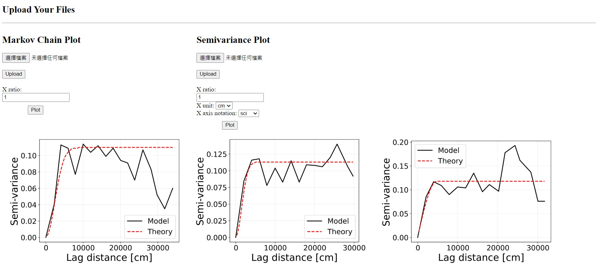
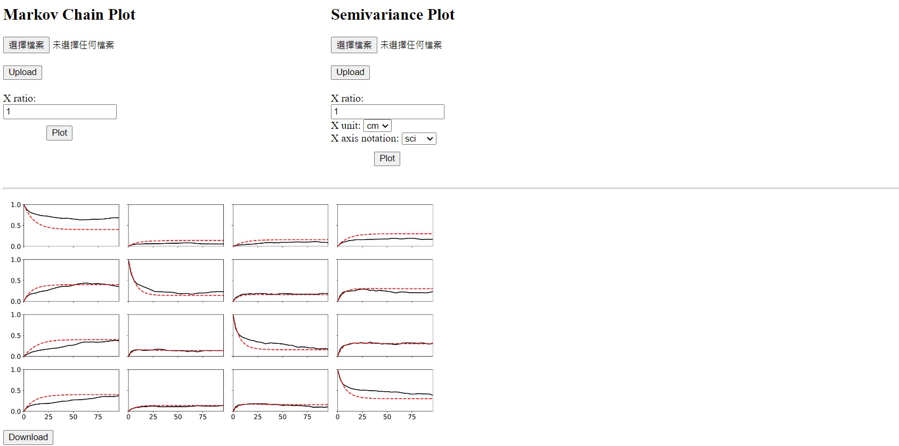

## GMS_Plot_app

This is a GMS plot app for Geohydraulic Lab.

### Semivariance plot

### Markov chain plot

## How to use

This is a web app made by flask python. The environment are based on the Windows-64 bit and Anaconda 3.

The following steps will let you create a small server on your machine. Which means everyone who knows the URL can get access to you machine.

1. First, make sure you have already download the anaconda 3

   https://www.anaconda.com/products/distribution

2. Open **PythonEnvironmentCreate.bat** to create the virtual env and install the necessary package.

3. (Optional) If you fail to install the packages, you can open **PythonEnvironmentInstall.bat** to reinstall.

4. Download the **ngrok.exe** from

   https://ngrok.com/

5. Sign up and login. Follow the steps to get the authentication of ngrok.

6. Put **ngrok.exe** to this folder

7. Open **Sever_connect(ngrok)**.bat and **Sever_activate.bat**, and you will see the app's URL from the cmd window.

8. Open the URL and start to upload the file and plot.
