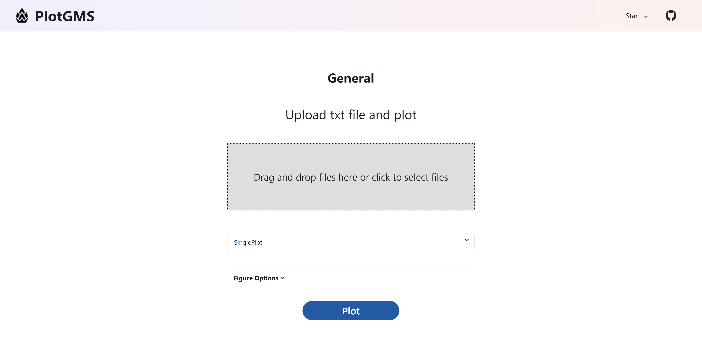

## PlotGMS


**PlotGMS** is a program used to visualize data quickly. Originally developed using the [Flask](https://github.com/pallets/flask) framework, it was only available to the GeoHydraulic laboratory as a fast way to visualize GMS model results using [Matplotlib](https://github.com/matplotlib/matplotlib). However, **PlotGMS** has now been refactored using the new Python web framework [Pynecone](https://github.com/pynecone-io/pynecone). In addition to the original plotting functions for GMS, it also provides some common visualization APIs. Users can simply upload files containing data in txt or csv format. Currently, **PlotGMS** only provides charts drawn using the [Plotly](https://github.com/plotly/plotly.py) plotting package, but in the future, other plotting packages such as [Matplotlib](https://github.com/matplotlib/matplotlib) may be added to provide users with more choices.


## Preview


## How to use

The live demo will be avaliabled soon. You can now choose to deploy on your local machine by running pynecone directly or running on the container (docker).

### Installation (running with pynecone)
You can run plotgms with python and pynecone directly
#### Prequest
Pynecone has version restrictions for the use of Python and Node.js as follows.
- Python3.7+
- Node.js 12.22.0+

Clone this repository
```bash
git clone https://github.com/Zncl2222/PlotGMS.git
```
If you using pipenv as your virtual enviroment tools, than you can just running following commands to complete the installation
```bash
# Create virtual enviroment
# Remember to change python version in Pipfile if you were not py3.11
pipenv shell
# Install packages
pipenv install
```
Or you can use pip to install
```bash
pip install -r requirements.txt
```

Initialize pynecone project
```bash
pc init
```

Before you run app, you should create .env file in you project root directory. All the requirements env are listed in env_example file. For example
```
# .env
API_URL="http://localhost:8000"
BACKEND_PORT="8000"
FRONTEND_PORT="3000"
MODE="DEV"
```

Run app
```bash
pc run
```

### Installation (running with docker)

<h4 align="center">

>__Warning__<br>
> pynecone have some problems when runing PROD mode in container, thus now docker is setted to run in dev mode

</h4>

If you want to running this app in a conatainer, this project offer a dockerfile to build plotgms easily.
#### Prequest
- Docker or DockerDesktop

Clone this repository
```bash
git clone https://github.com/Zncl2222/PlotGMS.git
```

Before you build docker image, you should create .env file in you project root directory. All the requirements env are listed in env_example file. For example
```
# .env
API_URL="http://localhost:8000"
BACKEND_PORT="8000"
FRONTEND_PORT="3000"
MODE="DEV"
```

Build docker image with followning command in propject root directory
```bash
docker build -t plotgms-app:latest .
```

Run docker container
```bash
docker run -d -p 3000:3000 -p 8000:8000 --name plotgms plotgms-app:latest
```

Finally you can connect to plotgms with the link http://localhost:3000
